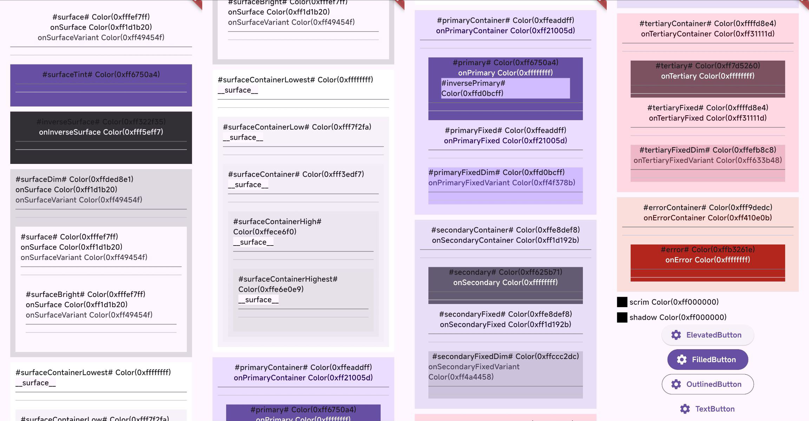

# Color Roles Display Tool

This tool is designed to display various color roles, helping developers check if color roles are correctly rendered, particularly after applying dynamic themes or highly customized Material Themes on Android S+ devices (Android 12+).

## Features
- Displays and verifies different color roles in Material Theme.
- Especially useful for dynamic themes on Android S+.
- Helps ensure consistency and correctness in color role implementation within dynamic or customized themes.

## License

This project is licensed under the MIT License.
